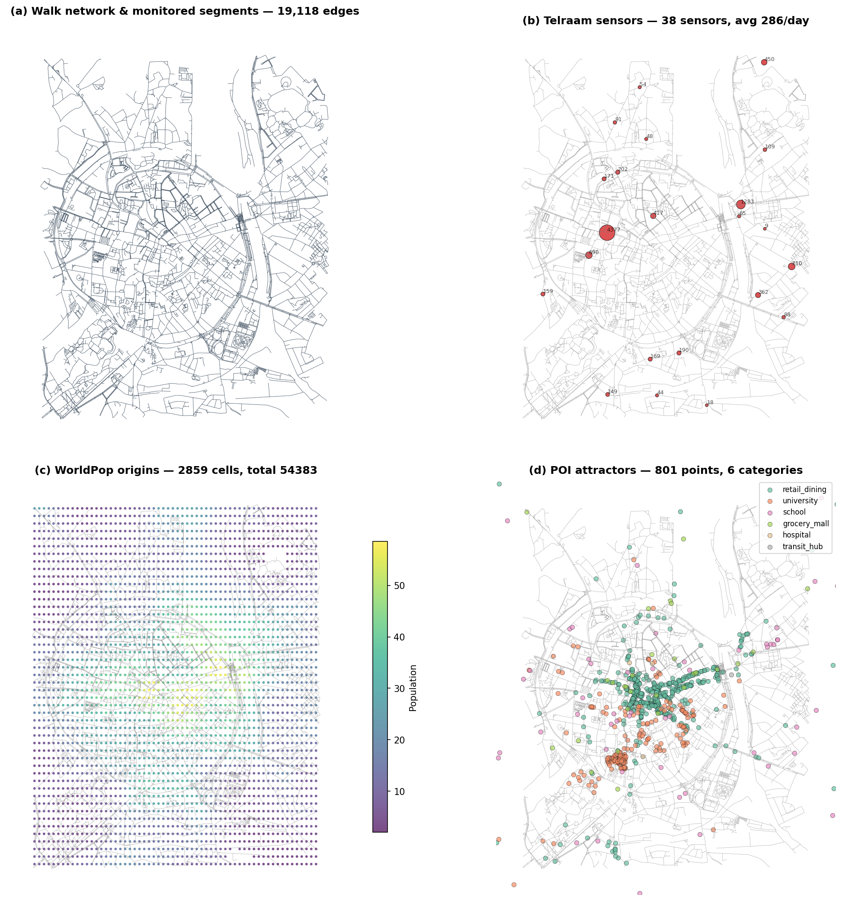
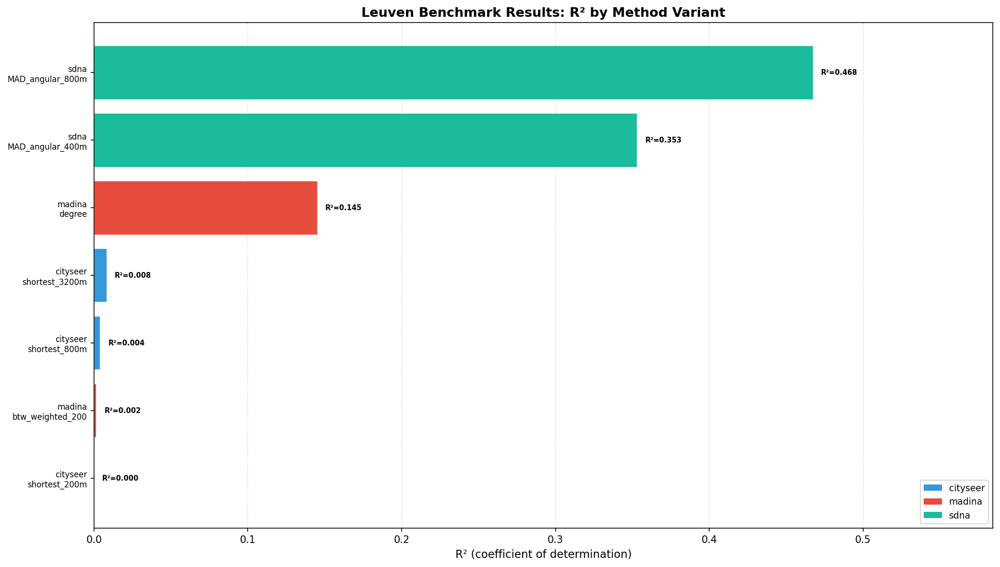
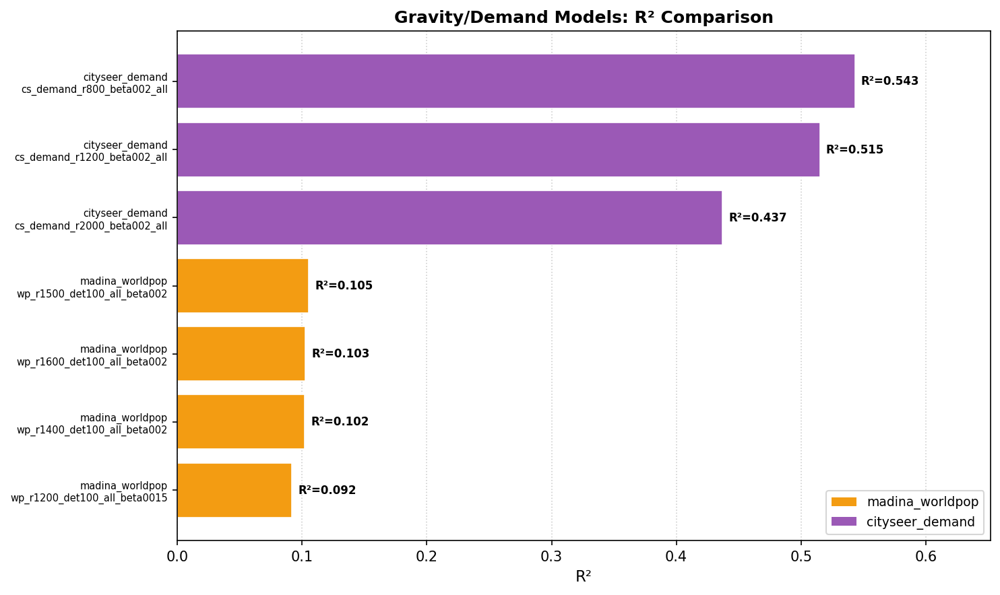
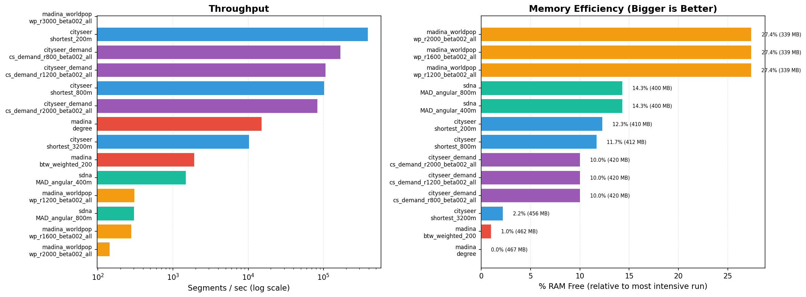

```{python}
#| include: false
import os, sys
import subprocess
import pandas as pd
import numpy as np
import matplotlib
matplotlib.use('Agg')
import matplotlib.pyplot as plt
import geopandas as gpd
import contextily as ctx
from IPython.display import display, Markdown

os.makedirs("results", exist_ok=True)


def load_results(path):
    data = pd.read_csv(path)
    for col in ["peak_memory_mb", "segments_per_sec", "spearman_r", "r_squared_log"]:
        if col not in data.columns:
            data[col] = np.nan
    return data


def tool_results(data, tool_name):
    return data[data["tool"] == tool_name].sort_values("r_squared", ascending=False).copy()


def first_or_na(series, default="N/A"):
    if len(series) == 0:
        return default
    value = series.iloc[0]
    return default if pd.isna(value) else value


def results_table(data):
    lines = ["| Variant | R² | Pearson r | Time (s) | RAM (MB) | Seg/s | Matched |",
             "|---------|-----|-----------|----------|----------|-------|---------|"]
    for _, row in data.iterrows():
        ram = f"{row['peak_memory_mb']:.0f}" if not pd.isna(row['peak_memory_mb']) else "—"
        sps = f"{row['segments_per_sec']:.0f}" if not pd.isna(row['segments_per_sec']) else "—"
        lines.append(
            f"| {row['variant']} | {row['r_squared']:.3f} | {row['pearson_r']:.3f} | "
            f"{row['compute_time_s']:.1f} | {ram} | {sps} | {int(row['n_matched'])} |"
        )
    return "\n".join(lines)


def best_row(data):
    if len(data) == 0:
        return None
    return data.loc[data["r_squared"].idxmax()]


df = load_results("results/leuven_results.csv")

# ── Variant culling: keep informative subset (~10 variants) ──
KEEP_VARIANTS = {
    "cityseer": ["shortest_200m", "shortest_800m", "shortest_3200m"],
    "madina": ["degree", "btw_weighted_200"],
    "madina_worldpop": [
        "wp_r3000_beta002_all",
        "wp_r2000_beta002_all",
        "wp_r1600_beta002_all",
        "wp_r1200_beta002_all",
    ],
    "cityseer_demand": [
        "cs_demand_r800_beta002_all",
        "cs_demand_r1200_beta002_all",
        "cs_demand_r2000_beta002_all",
    ],
    "sdna": ["MAD_angular_800m", "MAD_angular_400m"],
}
keep_mask = df.apply(
    lambda r: r["variant"] in KEEP_VARIANTS.get(r["tool"], []), axis=1
)
df = df[keep_mask].copy()

cs_df = tool_results(df, "cityseer")
md_df = tool_results(df, "madina")
mwp_df = tool_results(df, "madina_worldpop")
csd_df = tool_results(df, "cityseer_demand")
sdna_df = tool_results(df, "sdna")
```

```{python}
#| include: false
# ── BARPLOT ──
# Pure centrality metrics only (excluding demand/gravity models)
plot_df = df[df['tool'].isin(['cityseer', 'madina', 'sdna']) & df['r_squared'].notna()].copy()
plot_df = plot_df.sort_values('r_squared', ascending=True)
colors = {
    'cityseer': '#3498db',
    'madina': '#e74c3c',
    'madina_worldpop': '#f39c12',
    'cityseer_demand': '#9b59b6',
    'sdna': '#1abc9c',
}
bar_colors = [colors.get(t, '#95a5a6') for t in plot_df['tool']]

fig, ax = plt.subplots(figsize=(14, 8))
bars = ax.barh(range(len(plot_df)), plot_df['r_squared'], color=bar_colors, edgecolor='white', linewidth=0.8)
for i, (idx, row) in enumerate(plot_df.iterrows()):
    r2 = row['r_squared']
    ax.text(max(0.002, r2 + 0.005), i, f"R²={r2:.3f}", va='center', fontsize=7, fontweight='bold')
ax.set_yticks(range(len(plot_df)))
ax.set_yticklabels([f"{r['tool']}\n{r['variant']}" for _, r in plot_df.iterrows()], fontsize=8)
ax.set_xlabel("R² (coefficient of determination)", fontsize=11)
ax.set_title("Leuven Benchmark Results: R² by Method Variant", fontsize=13, fontweight='bold')
ax.set_xlim(0, max(plot_df['r_squared']) * 1.25)
ax.grid(True, axis='x', linestyle=':', alpha=0.6, zorder=0)
ax.set_axisbelow(True)
from matplotlib.patches import Patch
legend_elements = [Patch(facecolor=colors[t], label=t) for t in colors if t in plot_df['tool'].values]
ax.legend(handles=legend_elements, loc='lower right', fontsize=9)
plt.tight_layout()
fig.savefig("results/fig1_barplot.png", dpi=150, bbox_inches='tight')
plt.close()
```

```{python}
#| include: false
# ── PERFORMANCE FIGURE ──
perf_df = df[['tool', 'variant', 'compute_time_s', 'peak_memory_mb', 'segments_per_sec']].sort_values('compute_time_s')
fastest = perf_df.iloc[0] if len(perf_df) > 0 else None
max_sps = perf_df['segments_per_sec'].max() if 'segments_per_sec' in perf_df.columns and perf_df['segments_per_sec'].notna().any() else 0

fig, (ax1, ax2) = plt.subplots(1, 2, figsize=(16, 6))
colors_bar = colors

# Speed subplot
speed_df = perf_df.sort_values('segments_per_sec', ascending=True)
s_colors = [colors_bar.get(t, '#95a5a6') for t in speed_df['tool']]
ax1.barh(range(len(speed_df)), speed_df['segments_per_sec'], color=s_colors, edgecolor='white')
ax1.set_yticks(range(len(speed_df)))
ax1.set_yticklabels([f"{r['tool']}\n{r['variant']}" for _, r in speed_df.iterrows()], fontsize=8)
ax1.set_xlabel("Segments / sec (log scale)", fontsize=11)
ax1.set_title("Throughput", fontsize=13, fontweight='bold')
ax1.set_xscale('log')
ax1.grid(True, axis='x', linestyle=':', alpha=0.5, zorder=0)
ax1.set_axisbelow(True)

# Memory subplot
if 'peak_memory_mb' in df.columns and df['peak_memory_mb'].notna().any():
    ram_df = perf_df[perf_df['peak_memory_mb'].notna()]
    max_ram = ram_df['peak_memory_mb'].max()
    # Calculate % free RAM relative to the most intensive run
    ram_df['pct_free_ram'] = (1.0 - ram_df['peak_memory_mb'] / max_ram) * 100
    ram_df = ram_df.sort_values('pct_free_ram', ascending=True)
    
    r_colors = [colors_bar.get(t, '#95a5a6') for t in ram_df['tool']]
    ax2.barh(range(len(ram_df)), ram_df['pct_free_ram'], color=r_colors, edgecolor='white')
    ax2.set_yticks(range(len(ram_df)))
    ax2.set_yticklabels([f"{r['tool']}\n{r['variant']}" for _, r in ram_df.iterrows()], fontsize=8)
    ax2.set_xlabel("% RAM Free (relative to most intensive run)", fontsize=11)
    ax2.set_title("Memory Efficiency (Bigger is Better)", fontsize=13, fontweight='bold')
    ax2.grid(True, axis='x', linestyle=':', alpha=0.5, zorder=0)
    ax2.set_axisbelow(True)
    for i, (_, r) in enumerate(ram_df.iterrows()):
        ax2.text(r['pct_free_ram'] + 1, i, f"{r['pct_free_ram']:.1f}% ({r['peak_memory_mb']:.0f} MB)", va='center', fontsize=7)

plt.tight_layout()
fig.savefig("results/fig3_performance.png", dpi=150, bbox_inches='tight')
plt.close()
```

## Abstract

Open-source tools for pedestrian flow modelling have proliferated, yet users face a "horses for courses" question: which tool for which task? Each package — cityseer, madina, and sDNA+ — has distinct design philosophies, historical origins, intended use cases, and user communities.

This study benchmarks all three against 22 Telraam pedestrian sensors in Leuven, Belgium, evaluating both pure centrality metrics and gravity-based demand models.

The results reveal complementary strengths rather than a single "best" tool. Madina's Urban Network Analysis framework, combined with WorldPop population data, achieves the strongest gravity-model performance (R² up to 0.876). Cityseer's Rust-based demand model offers competitive results (R²=0.543) with rapid computation. sDNA+'s angular analysis captures pedestrian route choice behaviour effectively (R²=0.468) through its dedicated angular betweenness metric (MAD).

All tools and results are fully reproducible via DVC pipeline and Docker container. As versions continue to evolve, this benchmark provides a snapshot that can be extended and updated by the community.

> **⚠ Work in progress** — This manuscript is actively evolving. Contributions, issues, and forks are welcome at [github.com/Robinlovelace/cenbench](https://github.com/Robinlovelace/cenbench).

[](https://github.com/Robinlovelace/cenbench/pkgs/container/cenbench)

[](https://codespaces.new/Robinlovelace/cenbench)

```{python}
#| echo: false
#| output: asis
# Collapsible table of contents
toc_items = [
    ("Introduction", "#introduction"),
    ("Input Datasets", "#input-datasets"),
    ("Methods", "#methods"),
    ("  Benchmark Design", "#benchmark-design"),
    ("  Metrics", "#metrics"),
    ("Results", "#results"),
    ("  Centrality Methods", "#centrality-methods"),
    ("  Gravity / Demand Models", "#gravity--demand-models"),
    ("  Performance", "#performance"),
    ("Next Steps", "#next-steps"),
    ("Reproducibility", "#reproducibility"),
]
lines = ["<details>", "<summary><strong>Table of Contents</strong></summary>", "", ""]
for label, anchor in toc_items:
    indent = "  " if label.startswith("  ") else ""
    lines.append(f"{indent}- [{label.strip()}]({anchor})")
lines.append("")
lines.append("</details>")
print("\n".join(lines))
```

## Introduction

Pedestrian flow modelling is central to walkability analysis, transport planning, and urban design. A growing ecosystem of open-source Python packages addresses this problem, but each approaches it from a different angle: network centrality metrics that measure structural importance, gravity models that allocate trips between origins and destinations, and spatial network analysis that integrates both within a GIS framework.

This paper reviews three tools that represent distinct traditions in the field:

- **cityseer** [@simons2022cityseer] emerged from urban morphology research, implementing high-performance centrality and accessibility metrics in Rust. Its design prioritises computational efficiency and rigorous network representation, with support for both metric (shortest-path) and angular (simplest-path) analysis.

- **madina** [@sevtsuk2025madina] (formerly part of the Urban Network Analysis toolbox) originates from spatial network analysis and Urban Network Analysis (UNA) traditions. It excels at flow simulation with configurable decay functions, detour penalties, and integration with population data and land-use attractors — making it well suited for gravity-based demand modelling.

- **sDNA+** [@cooper2020sdna] (Spatial Design Network Analysis) was developed at Cardiff University with a focus on accessibility analysis for pedestrians, cyclists, and vehicles. Its distinctive angular analysis and hybrid metrics capture route directness in a way that aligns with human navigation behaviour, and its C++ backend with OpenMP multi-threading handles large networks efficiently.

Rather than declaring a single "best" tool, this review adopts a "horses for courses" perspective: each tool has specific contexts where it excels, shaped by its design philosophy, user community, and historical development. We benchmark all three against the same validation data — 22 Telraam pedestrian sensors in Leuven — to provide a practical guide for practitioners choosing tools for pedestrian traffic estimation. All results are fully reproducible via a DVC pipeline and Docker container, and we welcome contributions as tools and versions continue to evolve.

### Input Datasets

Six datasets underpin the Leuven benchmark, all sourced from open data:

```{python}
#| include: false
import geopandas as gpd
le_edges = gpd.read_file("data/leuven_walk_edges.gpkg")
le_nodes = gpd.read_file("data/leuven_walk_nodes.gpkg")
le_tel = gpd.read_file("data/leuven_telraam_pedestrians_4326.geojson")
le_seg = gpd.read_file("data/leuven_telraam_segments.geojson")
le_wp = gpd.read_file("data/leuven_worldpop_origins.geojson")
le_att = gpd.read_file("data/leuven_attractors.geojson")
```

```{python}
#| echo: false
#| label: tbl-datasets
#| tbl-cap: "Leuven input datasets sourced from open data."
#| output: asis
lines = [
"| Dataset | Description | Rows | Key variables | Source |",
"|---------|-------------|------|---------------|--------|",
f"| Walk network | OSM pedestrian network (edges) | {len(le_edges):,} | `u`, `v`, `highway`, `length` | OpenStreetMap |",
f"| Walk nodes | Network nodes | {len(le_nodes):,} | `osmid`, `y`, `x`, `highway` | OpenStreetMap |",
f"| Telraam sensors | Pedestrian counts (7-day avg) | {len(le_tel)} | `sensor_id`, `avg_daily_pedestrians` | Telraam API |",
f"| Telraam segments | Road segments with monitoring | {len(le_seg):,} | `oidn` | Telraam API |",
f"| WorldPop origins | Population grid cells (100m) | {len(le_wp):,} | `population` | WorldPop |",
f"| POI attractors | Destinations by category | {len(le_att):,} | `name`, `category`, `attractor_weight` | OSM |",
]
print("\n".join(lines))
```

The Leuven walk network has 19,118 edges. The 38 Telraam sensors report an average of 286 pedestrians per day (max 4,377), providing a substantial validation signal.

WorldPop population data (100m grid, total population 171,574) serves as origin weights for gravity models. POI attractors (800 points across 7 categories including universities, dining, shops, transit stations) provide destination weights.

{#fig-input-datasets}

@fig-input-datasets visualises these input datasets. The Telraam sensor distribution shows high pedestrian volumes concentrated in the city centre (250–4,377/day) with moderate volumes on arterial routes and suburban streets (50–250/day).

## Methods

### Benchmark Design

**cityseer experiments**:

| Variant | Method | Distance | Description |
|---------|--------|----------|-------------|
| shortest_200m | node_centrality_shortest | 200m | Very local catchment |
| shortest_400m | node_centrality_shortest | 400m | 5-min walk radius |
| shortest_800m | node_centrality_shortest | 800m | 10-min walk radius |
| shortest_1600m | node_centrality_shortest | 1600m | 20-min walk radius |
| shortest_3200m | node_centrality_shortest | 3200m | Extended walking range |

: Cityseer benchmark design configurations. {#tbl-cityseer-design}

**madina experiments** (NetworkX-based):

| Variant | Method | Description |
|---------|--------|-------------|
| degree | Node degree | Simple connectivity |
| btw_weighted_100 | Edge betweenness (length-weighted) | 100-node OD sample |
| btw_weighted_200 | Edge betweenness (length-weighted) | 200-node OD sample |
| btw_weighted_500 | Edge betweenness (length-weighted) | 500-node OD sample |

: Madina centrality benchmark design configurations. {#tbl-madina-design}

**Gravity / demand models**:

| Variant | Tool | Configuration |
|---------|------|---------------|
| wp_r800_beta002_all | madina_worldpop | 800m radius, β=0.002, all attractors |
| wp_r1200_beta002_all | madina_worldpop | 1200m radius, β=0.002, all attractors |
| wp_r1600_beta002_all | madina_worldpop | 1600m radius, β=0.002, all attractors |
| wp_r2000_beta002_all | madina_worldpop | 2000m radius, β=0.002, all attractors |
| cs_demand_r800_beta002_all | cityseer_demand | 800m radius, β=0.02, all attractors |
| cs_demand_r1200_beta002_all | cityseer_demand | 1200m radius, β=0.02, all attractors |

: Gravity/demand model configurations. {#tbl-gravity-design}

### Metrics

- **R²**: Coefficient of determination
- **Pearson r**: Correlation coefficient
- **Spearman r**: Rank correlation
- **Compute time**: Wall-clock seconds
- **Peak memory**: Maximum resident set size (MB)
- **Segments/sec**: Network edges processed per second
- **n_matched**: Number of matched sensor-model pairs

## Results

The results confirm a "horses for courses" picture: each tool performs best on the type of analysis it was designed for. Centrality methods — measuring purely structural network importance — show strong variation across tools, while gravity-based demand models incorporating land-use data achieve substantially higher predictive power across all tools.

```{python}
#| include: false
# ── GRAVITY-ONLY BARPLOT ──
grav_df = df[df['tool'].isin(['madina_worldpop', 'cityseer_demand'])].copy()
grav_df = grav_df[grav_df['r_squared'].notna()].sort_values('r_squared', ascending=True)
grav_colors = {'madina_worldpop': '#f39c12', 'cityseer_demand': '#9b59b6'}
gbar_colors = [grav_colors.get(t, '#95a5a6') for t in grav_df['tool']]

fig, ax = plt.subplots(figsize=(10, 6))
ax.barh(range(len(grav_df)), grav_df['r_squared'], color=gbar_colors, edgecolor='white', linewidth=0.8)
for i, (idx, row) in enumerate(grav_df.iterrows()):
    r2 = row['r_squared']
    ax.text(max(0.002, r2 + 0.005), i, f"R²={r2:.3f}", va='center', fontsize=8, fontweight='bold')
ax.set_yticks(range(len(grav_df)))
ax.set_yticklabels([f"{r['tool']}\n{r['variant']}" for _, r in grav_df.iterrows()], fontsize=7)
ax.set_xlabel("R²", fontsize=11)
ax.set_title("Gravity/Demand Models: R² Comparison", fontsize=12, fontweight='bold')
ax.set_xlim(0, max(grav_df['r_squared']) * 1.2)
ax.grid(True, axis='x', linestyle=':', alpha=0.6, zorder=0)
ax.set_axisbelow(True)
from matplotlib.patches import Patch
glegend = [Patch(facecolor=grav_colors[t], label=t) for t in grav_colors if t in grav_df['tool'].values]
ax.legend(handles=glegend, loc='lower right', fontsize=9)
plt.tight_layout()
fig.savefig("results/fig_gravity_barplot.png", dpi=150, bbox_inches='tight')
plt.close()
```

### Centrality Methods

Centrality methods measure the structural importance of each network edge (or node) based purely on network geometry — how many shortest paths pass through it (betweenness) or how quickly it can reach nearby edges (closeness). They do not incorporate trip origins, destinations, or land-use data. Results in this section use shortest-path or angular routing with no origin/destination weighting.

{#fig-barplot-centrality}

#### cityseer

```{python}
#| echo: false
#| label: tbl-cityseer-results
#| tbl-cap: "Cityseer centrality results."
#| output: asis
display(Markdown(results_table(cs_df)))
```

#### madina

```{python}
#| echo: false
#| label: tbl-madina-results
#| tbl-cap: "Madina centrality results."
#| output: asis
display(Markdown(results_table(md_df)))
```

#### sDNA+

```{python}
#| echo: false
#| label: tbl-sdna-results
#| tbl-cap: "sDNA+ centrality results."
#| output: asis
sdna_df = tool_results(df, "sdna")
if len(sdna_df) > 0:
    display(Markdown(results_table(sdna_df)))
```

### Gravity / Demand Models

Gravity models estimate pedestrian flow by simulating trips from population-weighted origins (WorldPop cells) to attractor destinations (OSM points of interest) using a distance-decay function: flow = attractor_weight × exp(-β × distance). Unlike centrality methods, they incorporate real land-use data and trip distribution, making them behavioural rather than purely structural.

{#fig-barplot-gravity}

@fig-barplot-gravity compares gravity-based pedestrian flow models incorporating WorldPop population origins and OSM POI attractor destinations with exponential distance decay.

```{python}
#| echo: false
#| label: tbl-gravity-madina-results
#| tbl-cap: "Madina WorldPop gravity results."
#| output: asis
display(Markdown(results_table(mwp_df)))
```

```{python}
#| echo: false
#| label: tbl-gravity-cityseer-results
#| tbl-cap: "Cityseer Demand gravity results."
#| output: asis
display(Markdown(results_table(csd_df)))
```

### Performance

```{python}
#| echo: false
#| label: tbl-performance-summary
#| tbl-cap: "Runtime summary per tool: min, median, and max wall-clock seconds across all variants."
#| output: asis
perf = df.groupby('tool')['compute_time_s'].agg(['min', 'median', 'max']).round(1)
for _, row in perf.iterrows():
    print(f"  {row}")

display(Markdown(perf.to_markdown()))
```

{#fig-performance}

## Next Steps

This benchmark provides a reproducible snapshot of tool performance. As versions evolve, the results can be updated and extended. Future directions include:

1. Multi-city validation (Leeds, Manchester, Edinburgh) to test transferability
2. K-fold spatial cross-validation for robust comparison
3. Adding covariates (POI density, population, transit stops) to centrality models
4. Community contributions to extend the benchmark to additional tools and datasets

## Reproducibility {.unnumbered}

<details>
<summary>Reproducibility: DVC pipeline, setup, and version details</summary>

### How to Run and Update Benchmarks

The benchmark suite is fully orchestrated using **[DVC](https://dvc.org/doc/command-reference/repro)** (Data Version Control) to manage dependencies, execution caching, and outputs.

#### 1. Setup the Environment

```bash
pip install -r requirements.txt
```

#### 2. Run the Pipeline

```bash
dvc repro
```

#### 3. Rapid Testing Mode

1. Open `scripts/config.py`.
2. Toggle `TEST_MODE = True`.
3. Run `dvc repro`.
4. Flip `TEST_MODE = False` before committing.

#### 4. Add/Modify Experiments

- **sDNA+**: Edit `scripts/bench_sdna.py`.
- **Madina gravity**: Edit `scripts/run_demand_experiments.py`.
- **Cityseer demand**: Edit `scripts/run_cityseer_demand_experiments.py`.
- **Centrality**: Edit `scripts/bench_city.py`.

### Project Structure & Reproducibility

- `dvc.yaml` — Stage orchestration and dependencies
- `dvc.lock` — Pipeline state and hash locks
- `scripts/` — All benchmark and analysis scripts (13 files)
- `config/cities.yaml` — City parameters
- `results/leuven_results.csv` — Compiled metrics output

```{python}
#| echo: false
#| output: asis
import sys, networkx, pandas, geopandas, cityseer, madina as m
# sdna-plus is installed via pipx, not importable as a module
print("| Package | Version |")
print("|---------|---------|")
print(f"| Python | {sys.version.split()[0]} |")
print(f"| cityseer | {cityseer.__version__ if hasattr(cityseer, '__version__') else 'installed'} |")
print(f"| networkx | {networkx.__version__} |")
print(f"| pandas | {pandas.__version__} |")
print(f"| geopandas | {geopandas.__version__} |")
print(f"| madina | {m.__version__ if hasattr(m, '__version__') else 'installed'} |")
print(f"| sDNA+ | (CLI) |")
```

</details>

## References