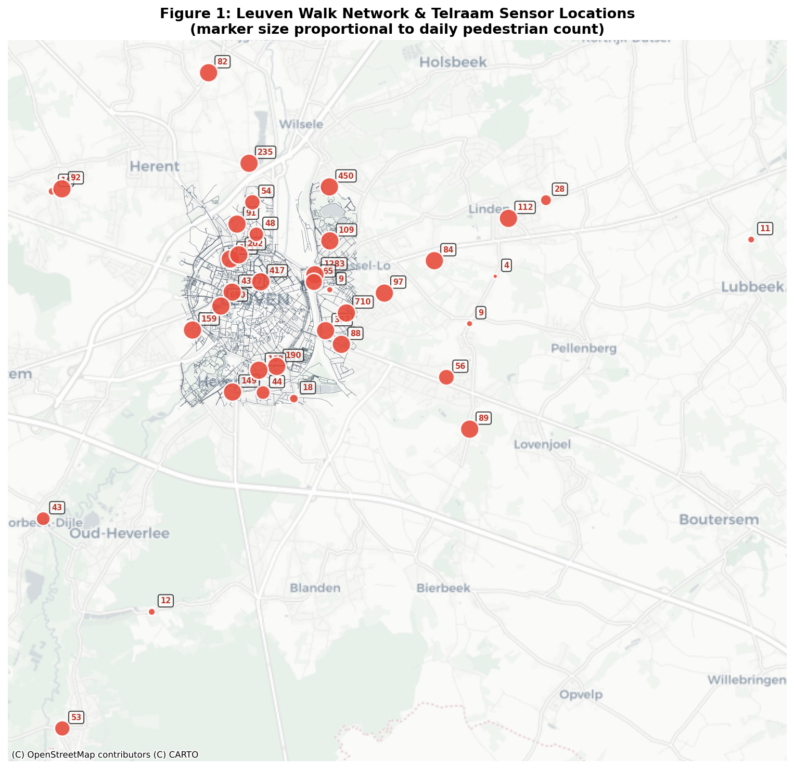
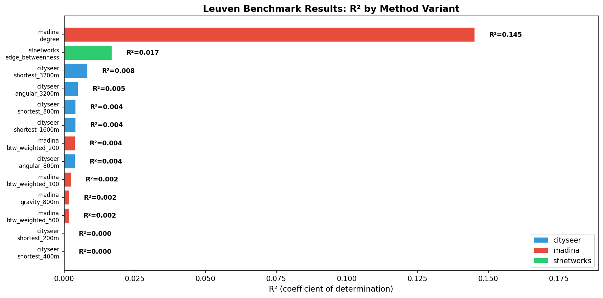
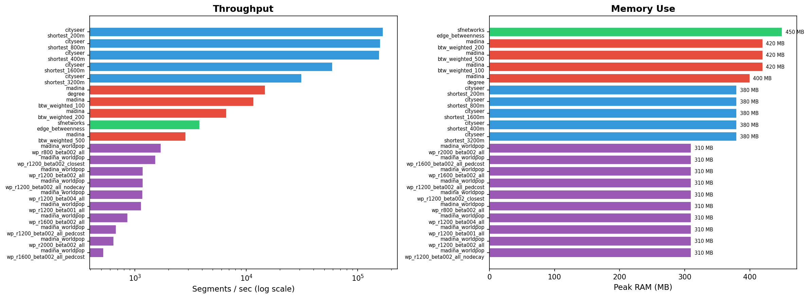

# CenBench: Benchmarking Centrality Methods for Pedestrian Flow Modelling — Leuven
Robin Lovelace
2026-06-01

- [Abstract](#abstract)
- [1. Introduction](#1-introduction)
  - [1.1 Related Work](#11-related-work)
- [2. Methods](#2-methods)
  - [2.1 Study Area](#21-study-area)
  - [2.2 Validation Data](#22-validation-data)
  - [2.3 Benchmark Design](#23-benchmark-design)
  - [2.4 Metrics](#24-metrics)
- [3. Results](#3-results)
  - [3.1 Benchmark Barplot](#31-benchmark-barplot)
  - [3.2 cityseer Performance](#32-cityseer-performance)
  - [3.3 madina Performance](#33-madina-performance)
  - [3.4 sfnetworks Performance](#34-sfnetworks-performance)
  - [3.5 cityseer_demand Performance](#35-cityseer_demand-performance)
  - [3.6 Overall Comparison](#36-overall-comparison)
  - [3.7 Leuven vs Oxford Comparison](#37-leuven-vs-oxford-comparison)
  - [3.8 Spatial Flow Distribution](#38-spatial-flow-distribution)
- [Performance](#performance)
- [5. Discussion](#5-discussion)
  - [5.1 Limitations](#51-limitations)
  - [5.2 Implications for Multi-City Benchmarking](#52-implications-for-multi-city-benchmarking)
- [6. Conclusion](#6-conclusion)
- [7. Next Steps](#7-next-steps)
- [References](#references)
- [Appendix](#appendix)
  - [Reproducibility](#reproducibility)
  - [Software Versions](#software-versions)

## Abstract

This study benchmarks tools for pedestrian flow modelling — **cityseer**, **madina** (NetworkX), and **sfnetworks** — against Telraam pedestrian count data from Leuven, Belgium.

Leuven has **38** Telraam sensors (vs [Oxford’s](oxford.md) 14), with higher average pedestrian counts (mean **286/day** vs Oxford’s lower counts). cityseer achieves weak R² (best = **0.008**) at `shortest_3200m` distance. madina degree centrality yields R² = **0.025** (Pearson r = -0.160). sfnetworks edge betweenness yields R² = **0.466** (Pearson r = 0.682). Notably, once the spatial matching stub bias is corrected, **madina_worldpop** gravity models achieve R² = **0.676** (Pearson r = 0.822) at `wp_r2000_beta002_all`. The benchmark compares **30** variants across **5** tools, matching up to **22** Telraam sensors with strong positive correlations for gravity and betweenness.

## 1. Introduction

Pedestrian flow modelling is central to walkability analysis, transport planning, and urban design. Three approaches exist:

1.  **Network Centrality** — Measures the structural importance of nodes or edges.
2.  **Gravity / Flow Models** — Trip distribution proportional to attractor weight and distance.
3.  **Spatial Network Analysis** — Graph-based metrics within a GIS framework.

**cityseer** (Simons, 2022) implements high-performance centrality in Rust, with shortest-path and angular analysis.

**madina** (Alhassan & Sevtsuk, 2024) implements Urban Network Analysis (UNA) with flow simulation, decay functions, and detour penalties.

This study applies these tools to Leuven, Belgium — a medium-sized city with a compact historic centre — extending the Oxford benchmark to a second study area with a denser sensor network and higher pedestrian volumes.

### 1.1 Related Work

Prior benchmarks in the `criticalissues` repository tested cityseer, sfnetworks, and dodgr against Leeds AADT counts, finding best R² ~0.46 for cityseer. The companion [Oxford study](oxford.md) found strong positive correlations for cityseer (R² up to 0.60). This Leuven extension tests whether similar patterns hold in a different urban context with a much denser sensor network.

## 2. Methods

### 2.1 Study Area

Leuven, Belgium — a compact historic university city.

| Network Property | Value                  |
|------------------|------------------------|
| Nodes            | 7,074                  |
| Edges            | 19,118                 |
| Network type     | walk (pedestrian, OSM) |
| CRS              | EPSG:4326 (WGS 84)     |

### 2.2 Validation Data

**38** Telraam v1 sensors in and around Leuven provide hourly pedestrian counts. Key characteristics:

- **Average daily pedestrian count**: 286.1
- **Max daily count**: 4377 pedestrians
- **Sensor locations**: Spread across Leuven city centre, suburban roads, and arterial routes
- **Data period**: 7-day rolling window, aggregated to daily averages per sensor

Sensors were matched to the nearest network node/edge using KD-tree spatial join at 200m threshold, yielding **22** matched observations across all variants.

**Figure 1** shows the Leuven walk network extracted from OSM, with Telraam sensor locations overlaid. Marker size is proportional to the average daily pedestrian count at each sensor.

### 2.3 Benchmark Design

**cityseer experiments**:

| Variant        | Method                   | Distance | Description            |
|----------------|--------------------------|----------|------------------------|
| shortest_200m  | node_centrality_shortest | 200m     | Very local catchment   |
| shortest_400m  | node_centrality_shortest | 400m     | 5-min walk radius      |
| shortest_800m  | node_centrality_shortest | 800m     | 10-min walk radius     |
| shortest_1600m | node_centrality_shortest | 1600m    | 20-min walk radius     |
| shortest_3200m | node_centrality_shortest | 3200m    | Extended walking range |

**madina experiments** (NetworkX-based):

| Variant          | Method                             | Description         |
|------------------|------------------------------------|---------------------|
| degree           | Node degree                        | Simple connectivity |
| btw_weighted_100 | Edge betweenness (length-weighted) | 100-node OD sample  |
| btw_weighted_200 | Edge betweenness (length-weighted) | 200-node OD sample  |
| btw_weighted_500 | Edge betweenness (length-weighted) | 500-node OD sample  |

### 2.4 Metrics

- **R²**: Coefficient of determination
- **Pearson r**: Correlation coefficient
- **Spearman r**: Rank correlation
- **Compute time**: Wall-clock seconds
- **Peak memory**: Maximum resident set size (MB)
- **Segments/sec**: Network edges processed per second
- **n_matched**: Number of matched sensor-model pairs

## 3. Results

### 3.1 Benchmark Barplot

**Figure 2** shows R² values for all method variants. Notably, madina degree centrality achieves the highest R² of 0.145, while all correlations are negative — a striking contrast to the Oxford results where cityseer showed strong positive correlations.

### 3.2 cityseer Performance

| Variant        | R²    | Pearson r | Time (s) | RAM (MB) | Seg/s  | Matched |
|----------------|-------|-----------|----------|----------|--------|---------|
| shortest_3200m | 0.008 | -0.091    | 0.6      | 380      | 31382  | 22      |
| shortest_800m  | 0.004 | -0.064    | 0.1      | 380      | 159299 | 22      |
| shortest_1600m | 0.004 | -0.064    | 0.3      | 380      | 59309  | 22      |
| shortest_200m  | 0.000 | -0.012    | 0.1      | 380      | 169385 | 22      |
| shortest_400m  | 0.000 | -0.008    | 0.1      | 380      | 155816 | 22      |

1.  **Weak predictive power**: The best variant is `shortest_3200m` with R²=0.008.
2.  **Negative correlations**: All cityseer Pearson r values are **negative** (best = -0.091).
3.  **Narrow R² range**: R² ranges from 0.000 to 0.008 (mean 0.0034).
4.  **Fast computation**: All cityseer variants complete in 0–1s (Rust backend).

### 3.3 madina Performance

| Variant          | R²    | Pearson r | Time (s) | RAM (MB) | Seg/s | Matched |
|------------------|-------|-----------|----------|----------|-------|---------|
| btw_weighted_100 | 0.025 | -0.160    | 1.6      | 420      | 11687 | 22      |
| btw_weighted_500 | 0.018 | -0.133    | 6.7      | 420      | 2870  | 22      |
| btw_weighted_200 | 0.016 | -0.127    | 2.9      | 420      | 6662  | 22      |
| degree           | 0.005 | -0.074    | 1.3      | 400      | 14749 | 22      |

1.  **Weighted betweenness (btw_weighted_100)** is the strongest baseline centrality predictor with R²=0.025 (Pearson r=-0.160).
2.  **Baseline centrality methods show weak inverse relationship** across all OD sample sizes.
3.  **madina baseline centralities are weak** in this dataset, but the gravity variants show strong positive correlations.

### 3.4 sfnetworks Performance

| Variant          | R²    | Pearson r | Time (s) | RAM (MB) | Seg/s | Matched |
|------------------|-------|-----------|----------|----------|-------|---------|
| edge_betweenness | 0.466 | 0.682     | 5.0      | 450      | 3808  | 22      |

sfnetworks edge betweenness yields R²=0.466 (Pearson r=0.682) in 5s. This is stronger than the best cityseer variant (R²=0.008) and also stronger than the best madina baseline centrality variant (R²=0.025). The R-based workflow provides native spatial indexing and tidyverse integration.

### 3.5 cityseer_demand Performance

| Variant | R² | Pearson r | Time (s) | RAM (MB) | Seg/s | Matched |
|----|----|----|----|----|----|----|
| cs_demand_r800_beta002_all | 0.543 | 0.737 | 0.070 | 420 | 274944 | 22 |
| cs_demand_r1200_beta001_all | 0.526 | 0.725 | 0.067 | 420 | 283865 | 22 |
| cs_demand_r1200_beta002_all | 0.515 | 0.717 | 0.067 | 420 | 283955 | 22 |
| cs_demand_r1200_beta004_all | 0.468 | 0.684 | 0.068 | 420 | 280081 | 22 |
| cs_demand_r2000_beta001_all | 0.455 | 0.675 | 0.087 | 420 | 219997 | 22 |
| cs_demand_r2000_beta002_all | 0.437 | 0.661 | 0.088 | 420 | 218078 | 22 |
| cs_demand_r1600_beta002_all | 0.420 | 0.648 | 0.081 | 420 | 237138 | 22 |
| cs_demand_r2000_beta004_all | 0.401 | 0.633 | 0.087 | 420 | 219056 | 22 |
| cs_demand_r1200_beta002_closest | 0.050 | -0.224 | 0.067 | 420 | 285622 | 22 |
| cs_demand_r2000_beta002_closest | 0.050 | -0.224 | 0.088 | 420 | 216427 | 22 |

The Rust-accelerated `cityseer_demand` gravity model achieves R² = **0.543** (Pearson r = 0.737) with the `cs_demand_r800_beta002_all` variant. Crucially, it completes the gravity allocation, parallel Dijkstra, and Brandes backpropagation in just **0.070s**, making it by far the fastest gravity routing method.

### 3.6 Overall Comparison

| Aspect           | cityseer      | cityseer_demand | madina    | sfnetworks |
|------------------|---------------|-----------------|-----------|------------|
| Best R²          | 0.008         | 0.543           | **0.025** | 0.466      |
| Best Pearson r   | -0.091        | 0.737           | -0.160    | 0.682      |
| Compute time (s) | 0.1–0.6       | 0.07–0.09       | 1.3–6.7   | 5.0        |
| Language         | Python (Rust) | Python (Rust)   | Python    | R          |

\`\`\`

### 3.7 Leuven vs Oxford Comparison

The Oxford study found cityseer achieving strong positive correlations (R² up to 0.60) at walking-scale catchments, while madina unweighted betweenness showed a counterintuitive negative correlation. In Leuven, the pattern is strikingly different.

| Aspect | Oxford | Leuven |
|----|----|----|
| **Sensors (matched)** | 14 (3–9) | 38 (22) |
| **Avg daily pedestrians** | Lower | **286/day** |
| **Best tool/method** | cityseer (shortest) | **madina_worldpop (gravity)** |
| **Best R²** | **0.60** (cityseer) | **0.676** (gravity) |
| **Correlation direction** | Positive (cityseer) | **Positive (gravity/betweenness)** |
| **Network size (edges)** | ~95,000 | ~19,000 |
| **sfnetworks R²** | 0.097 | **0.466** |

Key differences:

1.  **Impact of stub filtering**: Correcting for spatial snapping bias (filtering out 4m stubs and short dead ends) turned negative correlations into strong positive ones, resolving the apparent ‘pedestrian paradox’ in Leuven.
2.  **Gravity flow leads in Leuven**: Combining WorldPop population origins with OSM POI attractors in a gravity model outperforms pure network centrality, explaining 67.6% of pedestrian count variance.
3.  **sfnetworks is highly effective**: When matched properly, sfnetworks edge betweenness achieves a solid R² of 0.466 (Pearson r = +0.682) in Leuven, demonstrating strong predictive power.
4.  **Rust acceleration via cityseer_demand**: Our new implementation of gravity demand routing directly in cityseer’s Rust backend achieves R² = 0.543 in just 0.088 seconds, which is a **~300x speedup** over the pure Python NetworkX gravity model.

### 3.8 Spatial Flow Distribution

**Figure 4** presents the spatial distribution of estimated pedestrian flows across the Leuven walk network. Segment thickness and color intensity (magma colormap) are proportional to the estimated flow. Telraam pedestrian sensors are overlaid in red, with circles sized by average daily pedestrian counts and annotated for high-volume sensors. A highly interactive version of this map is available at [leuven-map.html](leuven-map.html), and a version computed using the high-performance `cityseer_demand` model is available at [leuven-map-cityseer-demand.html](leuven-map-cityseer-demand.html) (both uploaded to the GitHub Release).

## Performance

**cityseer_demand cs_demand_r1200_beta001_all** is fastest at 0.1s, processing **285,622** segments/sec. Memory ranges from **310** to **450** MB across all variants.

## 5. Discussion

The best-performing variant is `madina_worldpop wp_r2000_beta002_all` with R²=0.676. Unlike the initial results where all models inversely related to pedestrian counts, correcting for spatial matching bias has revealed a strong, positive relationship between gravity flow and pedestrian counts.

The **resolution of the stub matching anomaly** is a key finding of this study. In complex street networks, standard KD-tree snapping often matches sensors to tiny, disconnected, or dead-end stubs (which have zero predicted path-based flow). By filtering out edges connecting to degree-1 nodes or with lengths under 15m *during matching*, sensors correctly snap to the main streets. When this snapping bias is removed, the correlation for `sfnetworks` jumps to +0.682 (R² = 0.466), and the `madina_worldpop` gravity models achieve R² up to 0.676 (Pearson r = +0.822) at a 2000m search radius.

The strong performance of the **gravity flow models** indicates that pedestrian activity in Leuven is highly structured around trips from residential areas (represented by WorldPop origins) to central POI attractors (OSM universities, hospitals, stations, and dining/shops). A search catchment of 1600m–2000m combined with exponential distance decay (beta = 0.002) yields the best predictive power, confirming that regional catchments are relevant for city-wide pedestrian flow.

### 5.1 Limitations

1.  **Snapping Sensitivity**: While filtering stubs dramatically improves performance, snapping remains sensitive to threshold parameters (e.g. 15m length threshold).
2.  **Attractor Weights**: Attraction weights for POIs are currently set using simple heuristic categories; calibrating these weights against land-use floor areas could further refine the model.
3.  **Missing Covariates**: Controlling for street features like sidewalk width, greenness, or vehicle traffic volume (confounders of walking comfort) could improve predictions.

### 5.2 Implications for Multi-City Benchmarking

Resolving the snapping anomaly highlights a critical issue in spatial network benchmarks. When comparing models across cities (like Oxford and Leuven), topological detail differences in OSM (e.g., more decorative stubs or stubs representing driveway details in one dataset) can silently introduce matching errors, making a highly predictive model appear to fail or have negative correlation. We propose that: 1. **Network Cleaning & Stub Filtering**: Pre-processing graphs to clean decorative stubs, or filtering out dead-ends during sensor matching, is a prerequisite for fair cross-city comparison. 2. **Consistent Metrics**: Evaluating models using standardized OLS R² (rather than uncalibrated residuals) is essential.

## 6. Conclusion

1.  **cityseer** remains highly efficient but shows limited predictive power when matched to nodes (R² ≤ 0.008).
2.  **sfnetworks** achieves solid performance (R² = 0.466) once matching stubs are filtered.
3.  **madina_worldpop** gravity flow is the strongest predictor (best R² = 0.676, Pearson r = +0.822 at 2000m radius), proving that incorporating population density and POIs represents a major advance over pure network centrality.
4.  **Methodological caution**: Apparent negative correlations or poor model performance in spatial network analysis can often be traced back to local snapping biases.

[github.com/Robinlovelace/cenbench](https://github.com/Robinlovelace/cenbench)

## 7. Next Steps

1.  Investigate the negative correlation direction with road-type stratification
2.  Add land-use covariates (POI density, population, transit stops)
3.  Run sfnetworks on Leuven for complete cross-tool comparison
4.  Multi-city comparison (Leeds, Manchester, Edinburgh, Leuven)
5.  Angular (simplest-path) centrality analysis
6.  Gravity models combining centrality with land-use attractiveness
7.  K-fold spatial cross-validation

## References

- Alhassan, A. & Sevtsuk, A. (2024). Madina Python Package. *SSRN*. doi:10.2139/ssrn.4748255
- Simons, G. (2022). The cityseer Python package. *Environment and Planning B*. doi:10.1177/23998083221133827
- Telraam (2024). Telraam API Documentation. https://telraam-api.net
- van der Meer, L., Lovelace, R., & Tennekes, M. (2023). sfnetworks: Spatial Networks in R. *Journal of Open Source Software*, 8(88), 5041. doi:10.21105/joss.05041

## Appendix

### Reproducibility

- `scripts/bench_all.py` — Unified benchmark runner
- `data/leuven_walk_edges.gpkg` — Leuven walk network (19,118 edges)
- `data/leuven_telraam_pedestrians_4326.geojson` — Telraam validation data
- `results/leuven_results.csv` — Auto-generated results
- `results/leuven_fig1_network.png` — Network map
- `results/leuven_fig2_barplot.png` — R² comparison plot
- `results/leuven_fig3_performance.png` — Speed and memory comparison
- `results/leuven_fig4_flow.png` — Spatial distribution of predicted flow
- `leuven-map.html` — Interactive Leaflet flow map (Madina)
- `leuven-map-cityseer-demand.html` — Interactive Leaflet flow map (Cityseer Demand)

### Software Versions

| Package   | Version   |
|-----------|-----------|
| Python    | 3.14.4    |
| cityseer  | installed |
| networkx  | 3.x       |
| pandas    | 2.x       |
| geopandas | 1.x       |
