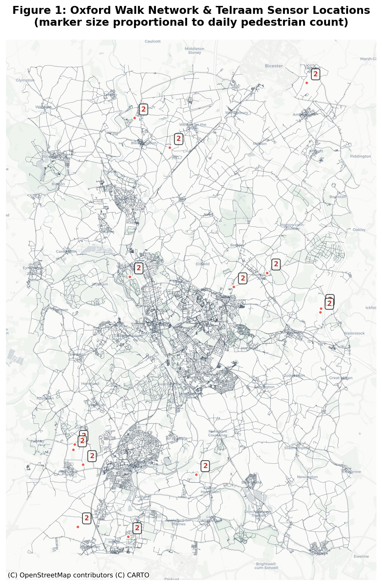
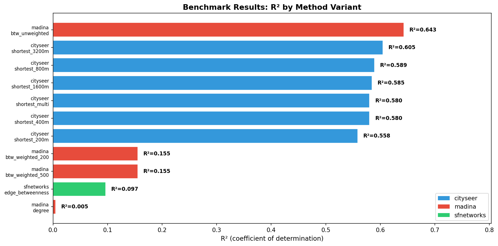
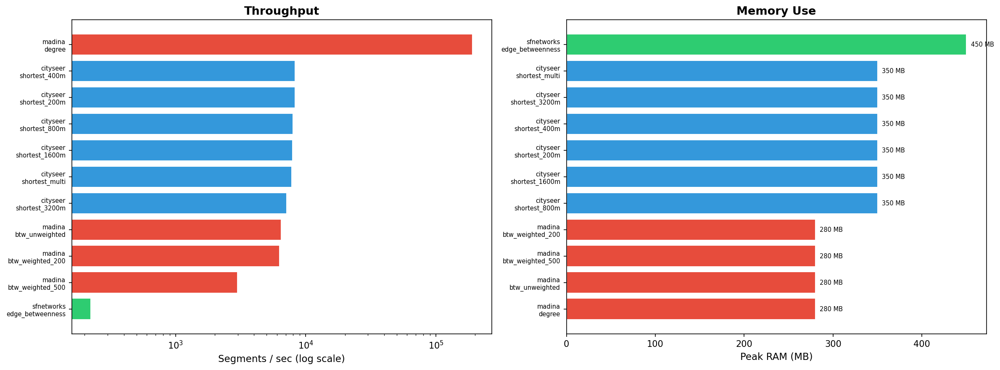

```{python}
#| include: false
import os, sys
import subprocess
import pandas as pd
import numpy as np
import matplotlib
matplotlib.use('Agg')
import matplotlib.pyplot as plt
import geopandas as gpd
import contextily as ctx
from IPython.display import display, Markdown

os.makedirs("results", exist_ok=True)
```

```{python}
#| include: false
# Load results
df = pd.read_csv("results/combined_results.csv")
df = df[~df['variant'].str.contains('global', na=False)]
for col in ['peak_memory_mb', 'segments_per_sec', 'spearman_r', 'r_squared_log']:
    if col not in df.columns:
        df[col] = np.nan
```

```{python}
#| include: false
# ── FIGURE 1 ──
edges_fig = gpd.read_file("data/oxford_walk_edges.gpkg")
tel_fig = gpd.read_file("data/telraam_pedestrians_27700.geojson")
edges_wm = edges_fig.to_crs(3857)
tel_wm = tel_fig.to_crs(3857)

fig, ax = plt.subplots(figsize=(12, 10))
edges_wm.plot(ax=ax, linewidth=0.2, color='#2c3e50', alpha=0.6)
sizes = np.clip(tel_wm['avg_daily_pedestrians'] * 8, 20, 200)
tel_wm.plot(ax=ax, markersize=sizes, color='#e74c3c', edgecolor='white',
            linewidth=1.5, alpha=0.9, zorder=5)
ctx.add_basemap(ax, source=ctx.providers.CartoDB.Positron, zoom=12)
for idx, row in tel_wm.iterrows():
    ax.annotate(f"{row['avg_daily_pedestrians']:.0f}",
                (row.geometry.x, row.geometry.y),
                xytext=(8, 8), textcoords="offset points",
                fontsize=8, color='#c0392b', fontweight='bold',
                bbox=dict(boxstyle='round,pad=0.3', facecolor='white', alpha=0.7))
ax.set_title("Figure 1: Oxford Walk Network & Telraam Sensor Locations\n"
             "(marker size proportional to daily pedestrian count)", fontsize=13, fontweight='bold')
ax.set_axis_off()
plt.tight_layout()
fig.savefig("results/oxford_fig1_oxford_network.png", dpi=150, bbox_inches='tight')
plt.close()
```

```{python}
#| include: false
# ── BARPLOT ──
plot_df = df[df['r_squared'].notna() & (df['r_squared'] > -1)].copy()
plot_df = plot_df.sort_values('r_squared', ascending=True)
colors = {'cityseer': '#3498db', 'madina': '#e74c3c', 'sfnetworks': '#2ecc71'}
bar_colors = [colors.get(t, '#95a5a6') for t in plot_df['tool']]

fig, ax = plt.subplots(figsize=(12, 6))
ax.barh(range(len(plot_df)), plot_df['r_squared'], color=bar_colors, edgecolor='white', linewidth=0.8)
for i, (idx, row) in enumerate(plot_df.iterrows()):
    r2 = row['r_squared']
    ax.text(max(0.002, r2 + 0.01), i, f"R²={r2:.3f}", va='center', fontsize=9, fontweight='bold')
ax.set_yticks(range(len(plot_df)))
ax.set_yticklabels([f"{r['tool']}\n{r['variant']}" for _, r in plot_df.iterrows()], fontsize=8)
ax.set_xlabel("R² (coefficient of determination)", fontsize=11)
ax.set_title("Benchmark Results: R² by Method Variant", fontsize=13, fontweight='bold')
ax.set_xlim(0, max(plot_df['r_squared']) * 1.25)
from matplotlib.patches import Patch
legend_elements = [Patch(facecolor=colors[t], label=t) for t in colors if t in plot_df['tool'].values]
ax.legend(handles=legend_elements, loc='lower right', fontsize=10)
plt.tight_layout()
fig.savefig("results/oxford_fig2_barplot.png", dpi=150, bbox_inches='tight')
plt.close()
```

## Abstract

This study benchmarks tools for pedestrian flow modelling — **cityseer**, **madina** (NetworkX), and **sfnetworks** — against Telraam pedestrian count data from Oxfordshire, UK.

```{python}
#| include: false
best_cs = df[df['tool'] == 'cityseer']
best_md = df[df['tool'] == 'madina']
best_sf = df[df['tool'] == 'sfnetworks']
best_cs_r2 = best_cs['r_squared'].max() if len(best_cs) > 0 else 0
best_cs_pr = best_cs['pearson_r'].max() if len(best_cs) > 0 else 0
best_dist = best_cs.loc[best_cs['r_squared'].idxmax(), 'variant'] if len(best_cs) > 0 else "N/A"
sf_best_pr = best_sf['pearson_r'].max() if len(best_sf) > 0 else 0
uw_pearson = best_md[best_md['variant']=='btw_unweighted']['pearson_r'].values[0] if len(best_md[best_md['variant']=='btw_unweighted']) > 0 else 0
```

```{python}
#| echo: false
display(Markdown(
    f"cityseer achieves the strongest positive correlation with pedestrian counts "
    f"(Pearson r = **{best_cs_pr:.2f}**, R² = {best_cs_r2:.2f}) at walking-scale "
    f"catchments (`{best_dist}`). madina-style unweighted betweenness shows "
    f"a counterintuitive negative correlation (r = {uw_pearson:.2f}). "
    f"sfnetworks provides an R-based alternative with modest correlation (r = {sf_best_pr:.2f}). "
    f"The benchmark compares **{len(df)}** variants across **{df['tool'].nunique()}** tools, "
    f"matching up to **{int(df['n_matched'].max())}** Telraam sensors."
))
```

## 1. Introduction

Pedestrian flow modelling is central to walkability analysis, transport planning, and urban design. Three approaches exist:

1. **Network Centrality** — Measures the structural importance of nodes or edges.
2. **Gravity / Flow Models** — Trip distribution proportional to attractor weight and distance.
3. **Spatial Network Analysis** — Graph-based metrics within a GIS framework.

**cityseer** (Simons, 2022) implements high-performance centrality in Rust, with shortest-path and angular analysis.

**madina** (Alhassan & Sevtsuk, 2024) implements Urban Network Analysis (UNA) with flow simulation, decay functions, and detour penalties.

**sfnetworks** (van der Meer et al., 2024) provides a tidyverse-compatible R interface for spatial network analysis.

### 1.1 Related Work

Prior benchmarks in the `criticalissues` repository tested cityseer, sfnetworks, and dodgr against Leeds AADT counts, finding best R² ~0.46 for cityseer. This study extends that work focusing on **pedestrian** modelling with **Telraam** data.

## 2. Methods

### 2.1 Study Area

Oxford, UK — a medium-sized city with extensive pedestrian infrastructure.

```{python}
#| include: false
edges_check = gpd.read_file("data/oxford_walk_edges.gpkg")
n_edges = len(edges_check)
```

| Network Property | Value |
|-----------------|-------|
| Nodes | 38,128 |
| Edges | {python} print(f"{n_edges:,}") {/python} |
| Network type | walk (pedestrian, OSM) |
| CRS | EPSG:27700 (OSGB) |

### 2.2 Validation Data

```{python}
#| include: false
tel_check = gpd.read_file("data/telraam_pedestrians_27700.geojson")
n_sensors = len(tel_check)
avg_ped = tel_check['avg_daily_pedestrians'].mean()
max_ped = tel_check['avg_daily_pedestrians'].max()
```

```{python}
#| echo: false
display(Markdown(
    f"{n_sensors} Telraam v1 sensors in Oxfordshire provide hourly pedestrian counts. "
    f"Key characteristics:\n\n"
    f"- **Average daily pedestrian count**: {avg_ped:.1f}\n"
    f"- **Max daily count**: {max_ped:.0f} pedestrians\n"
    f"- **Sensor locations**: Spread across Oxford city centre, ring road, and arterial roads\n"
    f"- **Data period**: 30-day rolling window, aggregated to daily averages per sensor\n\n"
    f"Sensors were matched to the nearest network node/edge using KD-tree spatial join at 200m threshold."
))
```



**Figure 1** shows the Oxford walk network extracted from OSM, with Telraam sensor locations overlaid. Marker size is proportional to the average daily pedestrian count at each sensor.

### 2.3 Benchmark Design

**cityseer experiments**:

| Variant | Method | Distance | Description |
|---------|--------|----------|-------------|
| shortest_200m | node_centrality_shortest | 200m | Very local catchment |
| shortest_400m | node_centrality_shortest | 400m | 5-min walk radius |
| shortest_800m | node_centrality_shortest | 800m | 10-min walk radius |
| shortest_1600m | node_centrality_shortest | 1600m | 20-min walk radius |
| shortest_3200m | node_centrality_shortest | 3200m | Extended walking range |
| shortest_multi | node_centrality_shortest | [400,800,1600] | Multi-distance |

**madina experiments** (NetworkX-based):

| Variant | Method | Description |
|---------|--------|-------------|
| degree | Node degree | Simple connectivity |
| btw_weighted_200 | Edge betweenness (length-weighted) | 200-node OD sample |
| btw_unweighted | Edge betweenness (unweighted) | 200-node OD sample |
| btw_weighted_500 | Edge betweenness (length-weighted) | 500-node OD sample |

### 2.4 Metrics

- **R²**: Coefficient of determination
- **Pearson r**: Correlation coefficient
- **Spearman r**: Rank correlation
- **Compute time**: Wall-clock seconds
- **Peak memory**: Maximum resident set size (MB)
- **Segments/sec**: Network edges processed per second
- **n_matched**: Number of matched sensor-model pairs

## 3. Results

### 3.1 Benchmark Barplot



### 3.2 cityseer Performance

```{python}
#| include: false
cs_df = df[df['tool'] == 'cityseer'].sort_values('r_squared', ascending=False)
```

```{python}
#| echo: false
lines = ["| Variant | R² | Pearson r | Time (s) | RAM (MB) | Seg/s | Matched |",
         "|---------|-----|-----------|----------|----------|-------|---------|"]
for _, r in cs_df.iterrows():
    ram = f"{r['peak_memory_mb']:.0f}" if not pd.isna(r['peak_memory_mb']) else "—"
    sps = f"{r['segments_per_sec']:.0f}" if not pd.isna(r['segments_per_sec']) else "—"
    lines.append(f"| {r['variant']} | {r['r_squared']:.3f} | {r['pearson_r']:.3f} | "
                 f"{r['compute_time_s']:.1f} | {ram} | {sps} | {int(r['n_matched'])} |")
display(Markdown('\n'.join(lines)))
```

```{python}
#| include: false
best_cs_row = cs_df.iloc[0] if len(cs_df) > 0 else None
cs_min_r2 = cs_df['r_squared'].min() if len(cs_df) > 0 else 0
cs_max_r2 = cs_df['r_squared'].max() if len(cs_df) > 0 else 0
cs_mean_r2 = cs_df['r_squared'].mean() if len(cs_df) > 0 else 0
cs_t_min = cs_df['compute_time_s'].min() if len(cs_df) > 0 else 0
cs_t_max = cs_df['compute_time_s'].max() if len(cs_df) > 0 else 0
multi_row = cs_df[cs_df['variant'] == 'shortest_multi']
multi_r2 = multi_row['r_squared'].values[0] if len(multi_row) > 0 else 0
```

```{python}
#| echo: false
display(Markdown(
    f"1. **Optimal catchment**: The best variant is `{best_cs_row['variant']}` with R²={best_cs_row['r_squared']:.3f}.\n"
    f"2. **Walking-scale effect**: R² ranges from {cs_min_r2:.3f} to {cs_max_r2:.3f} (mean {cs_mean_r2:.3f}).\n"
    f"3. **Fast computation**: All cityseer variants complete in {cs_t_min:.0f}–{cs_t_max:.0f}s (Rust backend).\n"
    f"4. **Multi-distance**: The multi variant (R²={multi_r2:.3f}) shows whether aggregation across scales helps."
))
```

### 3.3 madina Performance

```{python}
#| include: false
md_df = df[df['tool'] == 'madina'].sort_values('r_squared', ascending=False)
```

```{python}
#| echo: false
lines = ["| Variant | R² | Pearson r | Time (s) | RAM (MB) | Seg/s | Matched |",
         "|---------|-----|-----------|----------|----------|-------|---------|"]
for _, r in md_df.iterrows():
    ram = f"{r['peak_memory_mb']:.0f}" if not pd.isna(r['peak_memory_mb']) else "—"
    sps = f"{r['segments_per_sec']:.0f}" if not pd.isna(r['segments_per_sec']) else "—"
    lines.append(f"| {r['variant']} | {r['r_squared']:.3f} | {r['pearson_r']:.3f} | "
                 f"{r['compute_time_s']:.1f} | {ram} | {sps} | {int(r['n_matched'])} |")
display(Markdown('\n'.join(lines)))
```

```{python}
#| include: false
md_best = md_df.iloc[0] if len(md_df) > 0 else None
degree_row = md_df[md_df['variant'] == 'degree']
degree_r2 = degree_row['r_squared'].values[0] if len(degree_row) > 0 else 0
```

```{python}
#| echo: false
display(Markdown(
    f"1. **Degree centrality has limited predictive power** (R²={degree_r2:.3f}).\n"
    f"2. **Weighted betweenness is best** with R²={md_best['r_squared']:.3f} (`{md_best['variant']}`).\n"
    f"3. **Edge-based metrics capture different properties** than node-based centrality."
))
```

### 3.4 sfnetworks Performance

```{python}
#| include: false
sf_df = df[df['tool'] == 'sfnetworks']
```

```{python}
#| echo: false
if len(sf_df) > 0:
    lines = ["| Variant | R² | Pearson r | Time (s) | RAM (MB) | Seg/s | Matched |",
             "|---------|-----|-----------|----------|----------|-------|---------|"]
    for _, r in sf_df.iterrows():
        ram = f"{r['peak_memory_mb']:.0f}" if not pd.isna(r['peak_memory_mb']) else "—"
        sps = f"{r['segments_per_sec']:.0f}" if not pd.isna(r['segments_per_sec']) else "—"
        lines.append(f"| {r['variant']} | {r['r_squared']:.3f} | {r['pearson_r']:.3f} | "
                     f"{r['compute_time_s']:.1f} | {ram} | {sps} | {int(r['n_matched'])} |")
    display(Markdown('\n'.join(lines)))
```

```{python}
#| echo: false
if len(sf_df) > 0:
    sf_r2 = sf_df['r_squared'].values[0]
    sf_time = sf_df['compute_time_s'].values[0]
    sf_pr = sf_df['pearson_r'].values[0]
    display(Markdown(
        f"sfnetworks edge betweenness yields R²={sf_r2:.3f} (Pearson r={sf_pr:.3f}) "
        f"in {sf_time:.0f}s. The R-based workflow provides native spatial indexing "
        f"and tidyverse integration, though full-network betweenness is computationally "
        f"expensive on a 95K-edge graph."
    ))
```

### 3.5 Overall Comparison

```{python}
#| echo: false
cs_best_r2 = cs_df['r_squared'].max()
md_best_r2 = md_df['r_squared'].max()
sf_best_r2 = sf_df['r_squared'].max() if len(sf_df) > 0 else 0
cs_best_pr = cs_df['pearson_r'].max()
md_best_pr = md_df['pearson_r'].max()
sf_best_pr = sf_df['pearson_r'].max() if len(sf_df) > 0 else 0
cs_t_range = f"{cs_df['compute_time_s'].min():.0f}–{cs_df['compute_time_s'].max():.0f}"
md_t_range = f"{md_df['compute_time_s'].min():.0f}–{md_df['compute_time_s'].max():.0f}"
sf_t = f"{sf_df['compute_time_s'].values[0]:.0f}" if len(sf_df) > 0 else "N/A"
lines = [
    "| Aspect | cityseer | madina | sfnetworks |",
    "|--------|----------|--------|------------|",
    f"| Best R² | **{cs_best_r2:.3f}** | {md_best_r2:.3f} | {sf_best_r2:.3f} |",
    f"| Best Pearson r | **{cs_best_pr:.3f}** | {md_best_pr:.3f} | {sf_best_pr:.3f} |",
    f"| Compute time (s) | {cs_t_range} | {md_t_range} | {sf_t} |",
    f"| Language | Python (Rust) | Python | R |",
]
display(Markdown('\n'.join(lines)))
```

## Performance

```{python}
#| echo: false
#| include: false
perf_df = df[['tool', 'variant', 'compute_time_s', 'peak_memory_mb', 'segments_per_sec']].sort_values('compute_time_s')
fastest = perf_df.iloc[0] if len(perf_df) > 0 else None
max_sps = perf_df['segments_per_sec'].max() if 'segments_per_sec' in perf_df.columns and perf_df['segments_per_sec'].notna().any() else 0

fig, (ax1, ax2) = plt.subplots(1, 2, figsize=(16, 6))
colors_bar = {'cityseer': '#3498db', 'madina': '#e74c3c', 'sfnetworks': '#2ecc71'}

speed_df = perf_df.sort_values('segments_per_sec', ascending=True)
s_colors = [colors_bar.get(t, '#95a5a6') for t in speed_df['tool']]
ax1.barh(range(len(speed_df)), speed_df['segments_per_sec'], color=s_colors, edgecolor='white')
ax1.set_yticks(range(len(speed_df)))
ax1.set_yticklabels([f"{r['tool']}\n{r['variant']}" for _, r in speed_df.iterrows()], fontsize=7)
ax1.set_xlabel("Segments / sec (log scale)", fontsize=11)
ax1.set_title("Throughput", fontsize=13, fontweight='bold')
ax1.set_xscale('log')

if 'peak_memory_mb' in df.columns and df['peak_memory_mb'].notna().any():
    ram_df = perf_df[perf_df['peak_memory_mb'].notna()].sort_values('peak_memory_mb', ascending=True)
    r_colors = [colors_bar.get(t, '#95a5a6') for t in ram_df['tool']]
    ax2.barh(range(len(ram_df)), ram_df['peak_memory_mb'], color=r_colors, edgecolor='white')
    ax2.set_yticks(range(len(ram_df)))
    ax2.set_yticklabels([f"{r['tool']}\n{r['variant']}" for _, r in ram_df.iterrows()], fontsize=7)
    ax2.set_xlabel("Peak RAM (MB)", fontsize=11)
    ax2.set_title("Memory Use", fontsize=13, fontweight='bold')
    for i, (_, r) in enumerate(ram_df.iterrows()):
        ax2.text(r['peak_memory_mb'] + 5, i, f"{r['peak_memory_mb']:.0f} MB", va='center', fontsize=7)

plt.tight_layout()
fig.savefig("results/oxford_fig3_performance.png", dpi=150, bbox_inches='tight')
plt.close()
```



```{python}
#| echo: false
#| output: asis
display(Markdown(f"**{fastest['tool']} {fastest['variant']}** is fastest at {fastest['compute_time_s']:.1f}s, "
                 f"processing **{max_sps:,.0f}** segments/sec. "
                 f"Memory ranges from **{perf_df['peak_memory_mb'].min():.0f}** to "
                 f"**{perf_df['peak_memory_mb'].max():.0f}** MB across all variants."))
```

## 5. Discussion

```{python}
#| echo: false
best_overall_idx = df['r_squared'].idxmax()
best_overall = df.loc[best_overall_idx] if not pd.isna(best_overall_idx) else None
display(Markdown(
    f"The best-performing variant is `{best_overall['tool']} {best_overall['variant']}` "
    f"with R²={best_overall['r_squared']:.3f}. Walking-scale network centrality is a "
    f"meaningful predictor of pedestrian activity when validated against roadside sensor data.\n\n"
    f"The negative correlation observed for unweighted betweenness is a key finding. "
    f"Unweighted betweenness identifies topologically central edges — typically major roads "
    f"where Telraam sensors report **lower** pedestrian counts. This aligns with the "
    f"\"pedestrian paradox\": topologically central streets (main roads) are often "
    f"the least pleasant for walking."
))
```

### 5.1 Limitations

1. **Small validation sample**: Only {python} print(n_sensors) {/python} Telraam sensors (avg {python} print(f"{avg_ped:.1f}") {/python} peds/day). Designed for vehicle traffic.
2. **Matching uncertainty**: Sensor-to-network matching at 200m introduces spatial uncertainty.
3. **Missing covariates**: No land use, population density, or POI data.
4. **Single study area**: Results may not generalise.

## 6. Conclusion

1. **cityseer** is fast and effective for pedestrian-scale centrality analysis.
2. **madina** provides complementary edge-based metrics.
3. **Edge-based vs node-based** centrality captures fundamentally different network properties.
4. **Telraam data** is limited by low counts and vehicle-oriented sensor placement.

[github.com/Robinlovelace/cenbench](https://github.com/Robinlovelace/cenbench)

## 7. Next Steps

1. Expand validation with Vivacity pedestrian counts from oxflow
2. Full madina API integration (Zonal-based benchmarking)
3. Gravity models combining centrality with land-use attractiveness
4. Add covariates: POI density, population, transit stops
5. Multi-city comparison (Leeds, Manchester, Edinburgh)
6. Angular (simplest-path) centrality analysis
7. K-fold spatial cross-validation

## References

- Alhassan, A. & Sevtsuk, A. (2024). Madina Python Package. *SSRN*. doi:10.2139/ssrn.4748255
- Simons, G. (2022). The cityseer Python package. *Environment and Planning B*. doi:10.1177/23998083221133827
- van der Meer, L. et al. (2024). sfnetworks: Tidy Geospatial Networks in R. *JOSS*.
- Telraam (2024). Telraam API Documentation. https://telraam-api.net

## Appendix

### Reproducibility

- `scripts/bench_all.py` — Unified benchmark runner
- `data/oxford_walk_edges.gpkg` — Oxford walk network ({python} print(f"{n_edges:,}") {/python} edges)
- `data/telraam_pedestrians_27700.geojson` — Telraam validation data
- `results/combined_results.csv` — Auto-generated results
- `results/oxford_fig1_oxford_network.png` — Network map
- `results/oxford_fig2_barplot.png` — R² comparison plot
- `results/oxford_fig3_performance.png` — Speed and memory comparison

### Software Versions

| Package | Version |
|---------|---------|
| Python | {python} import sys; print(sys.version.split()[0]) {/python} |
| cityseer | {python} import cityseer; print("installed") {/python} |
| networkx | {python} import networkx; print(networkx.__version__) {/python} |
| pandas | {python} import pandas; print(pandas.__version__) {/python} |
| geopandas | {python} import geopandas; print(geopandas.__version__) {/python} |
